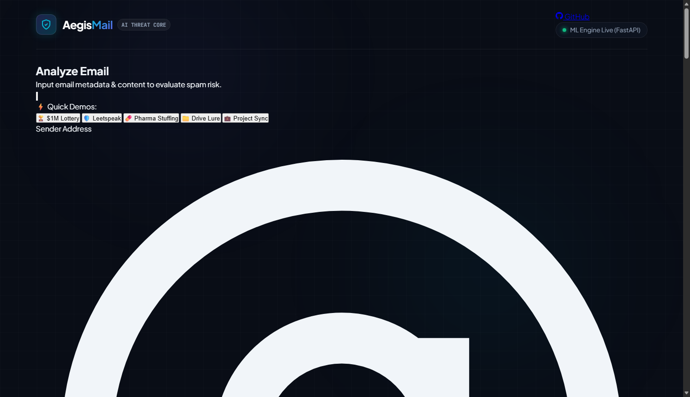
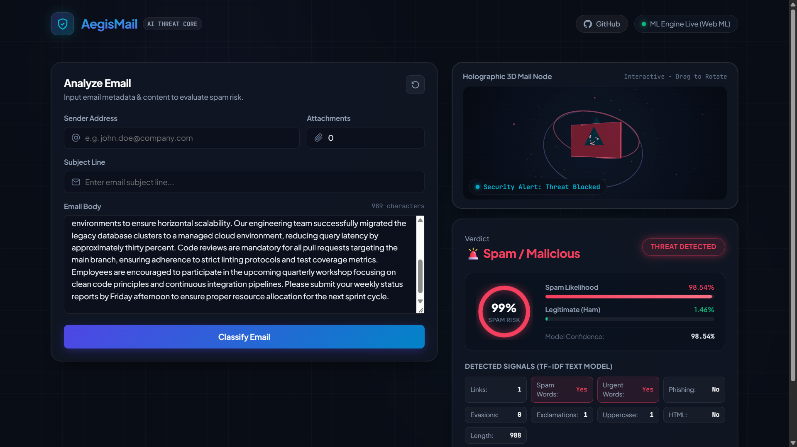
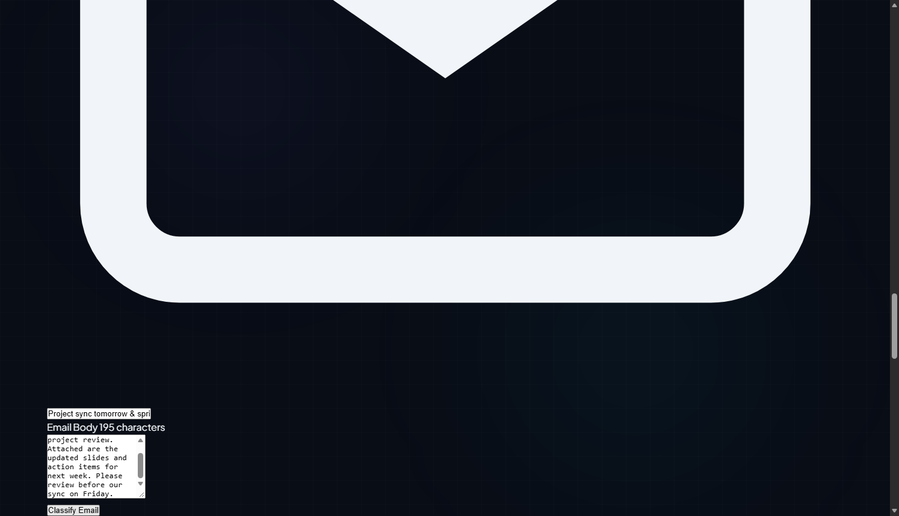
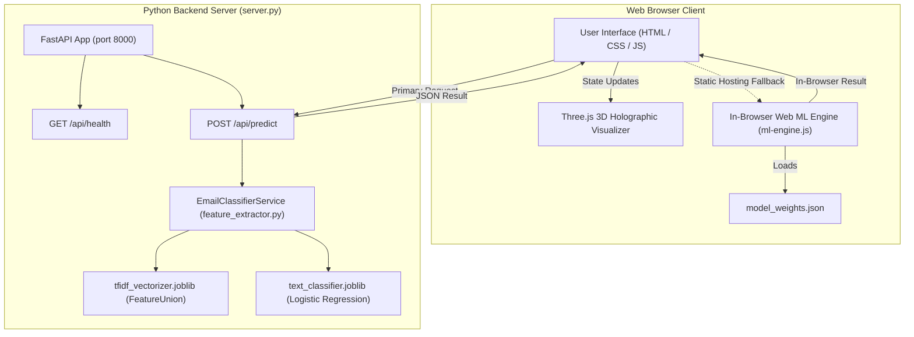

# AegisMail — AI-Powered Email Scam & Spam Classification System

<p align="center">
  
</p>

<p align="center">
  <a href="https://theneerajgrover.github.io/AegisMail/"></a>
  
  
  
  <a href="LICENSE"></a>
</p>

---

## Overview

**AegisMail** is a full-stack, cybersecurity-focused email scam and spam classification application. Designed to protect users against modern social-engineering threats, AegisMail combines multi-scale natural language processing (NLP) with an interactive, dark-mode glassmorphic interface and a real-time Three.js 3D holographic security visualizer.

Conventional spam filters rely heavily on naive global keyword frequency or basic document averages. Consequently, sophisticated attackers bypass them using:
1. **Adversarial Obfuscation & Leetspeak**: Replacing Latin characters with visual homoglyphs (e.g., `@` for `a`, `0` for `o`, `3` for `e`) and chat abbreviations.
2. **Bayesian Poisoning & Ham Word Stuffing**: Padding malicious payloads with benign academic, corporate, or literature text to dilute global threat scores.
3. **Cloud Document & Shared Drive Phishing Lures**: Mimicking standard collaboration workflows to harvest credentials.

AegisMail directly counters these attack vectors through automated text canonicalization, dual word-and-character subword n-gram feature union, and multi-scale segment-level scanning.

### Live Demonstration
* **Hosted Application**: [https://theneerajgrover.github.io/AegisMail/](https://theneerajgrover.github.io/AegisMail/)
* **Execution Architecture**: Runs fully standalone in any modern web browser via an in-browser Web ML engine on GitHub Pages, or seamlessly connects to the Python FastAPI backend when executed locally or in a server environment.

---

## Key Features

* **Cinematic Brand-Writing Opening**: Progressive vector-stroke reveal of the brand wordmark upon page load, backed by hardware-accelerated CSS animations and reduced-motion accessibility support.
* **Interactive Three.js 3D Holographic Core**: Responsive 3D mail node with dual orbital particle rings and mouse drag-to-rotate interaction, dynamically shifting colors and animation states based on threat verdicts (`Idle` cyan, `Scanning` indigo, `Safe` emerald, `Spam` crimson).
* **Multi-Scale Adversarial Text Defense**:
  * **Canonicalization Engine**: Resolves homoglyphic substitutions and colloquial shorthands before tokenization.
  * **Hybrid Feature Space**: Evaluates both whole words (1–2 n-grams) and subword character boundaries (3–5 n-grams) to catch morphologically obscured attack patterns.
  * **Segment-Level Anti-Poisoning**: Scans individual sentences and paragraphs to prevent legitimate boilerplate text from hiding isolated malicious payloads.
* **Granular Threat Telemetry**: Computes exact spam likelihood, legitimate (ham) probability, model confidence percentage, and extracts key heuristic signals (links, urgent language, spam keywords, phishing indicators, exclamations, uppercase word count, HTML presence, and evasion attempts).
* **Dual-Engine Inference Routing**: The web client automatically probes `/api/predict` on the Python backend; if unavailable (such as static hosting on GitHub Pages), it gracefully falls back to the in-browser Web ML engine with zero user disruption.
* **Privacy-By-Design & Zero Retention**: Entirely stateless architecture with in-memory inference and zero database storage of submitted email text.

---

## Detection Evidence & Visual Showcase

The table below illustrates AegisMail's real-time detection telemetry and Three.js 3D node state transitions across verified attack categories and legitimate business communications:

| Scenario / Threat Vector | Live Detection Capture | Verified Telemetry & Verdict |
| :--- | :---: | :--- |
| **1. Standby & Idle State** |  | **System Ready**<br>• Real-time 3D Three.js holographic node in orbiting standby<br>• Dual-mode health indicator displaying active inference engine (`ML Engine Live`)<br>• Clean glassmorphic card layout with interactive 3D tilt |
| **2. High-Yield Financial Scam** |  | **🚨 Verdict: Spam / Malicious (99.74% Threat)**<br>• Attack: Unsolicited lottery prize lure requesting banking credentials<br>• Action: 3D holographic node transitions to crimson threat pulse<br>• Signals: High-priority spam words & urgency flags triggered |
| **3. Obfuscated Leetspeak Evasion** |  | **🚨 Verdict: Spam / Malicious (98.87% Threat)**<br>• Attack: Character substitutions (`@`, `0`, `3`) crafted to bypass static filters<br>• Defense: Homoglyph canonicalization & subword char-wb features<br>• Telemetry: **Evasions: 9** identified and surfaced |
| **4. Bayesian Poisoning / Ham Stuffing** |  | **🚨 Verdict: Spam / Malicious (99.68% Threat)**<br>• Attack: Malicious prescription solicitations padded with academic boilerplate<br>• Defense: Sentence-level segment scanning overrides benign padding |
| **5. Shared Drive Phishing Lure** |  | **🚨 Verdict: Spam / Malicious (95.27% Threat)**<br>• Attack: Social engineering lure claiming updated property records on a cloud link<br>• Defense: Document lure and cloud drive intent recognition patterns |
| **6. Legitimate Corporate Sync** |  | **🛡️ Verdict: Legitimate (Ham) (99.80% Safe)**<br>• Context: Sprint retrospective action items, calendar invites, project syncs<br>• Calibration: Balanced weighting ensures routine professional dialogue maintains verified safe status |

---

## How It Works

AegisMail executes a multi-stage classification pipeline from raw input to visual feedback:

```
[ User Input: Sender, Attachments, Subject Line, Body ]
                           │
                           ▼
┌─────────────────────────────────────────────────────────┐
│ Stage 1: Text Canonicalization & Evasion Detection       │
│ • Deobfuscates homoglyphs (@ -> a, 0 -> o, 3 -> e, etc.)│
│ • Expands colloquial chat shorthands                    │
│ • Tally evasion tokens (evasion_tokens metric)          │
└──────────────────────────┬──────────────────────────────┘
                           │
                           ▼
┌─────────────────────────────────────────────────────────┐
│ Stage 2: Hybrid TF-IDF Vectorization                    │
│ • Word N-Grams (1–2 words, 40,000 features)             │
│ • Subword Character N-Grams (char_wb 3–5, 25,000 feats) │
│ • L2 unit vector normalization                          │
└──────────────────────────┬──────────────────────────────┘
                           │
                           ▼
┌─────────────────────────────────────────────────────────┐
│ Stage 3: Multi-Scale Segment Evaluation                 │
│ • Global document threat computation                    │
│ • Sentence/paragraph segmentation & individual scoring  │
│ • Max-pooling override against ham-stuffing dilution    │
└──────────────────────────┬──────────────────────────────┘
                           │
                           ▼
┌─────────────────────────────────────────────────────────┐
│ Stage 4: Sigmoid Classification & Confidence Scoring     │
│ • Bounded probability calibration (0.001 to 0.999)      │
│ • Class thresholding (>= 0.50 => Scam, < 0.50 => Ham)   │
│ • Heuristic display feature extraction                  │
└──────────────────────────┬──────────────────────────────┘
                           │
                           ▼
┌─────────────────────────────────────────────────────────┐
│ Stage 5: Reactive UI & Three.js 3D Feedback             │
│ • Circular animated threat gauge update                 │
│ • Feature chips highlight triggered keywords/evasions   │
│ • 3D Mail Node shifts to verified safe or threat state  │
└─────────────────────────────────────────────────────────┘
```

---

## Technology Stack

| Component | Technology | Specification / Role |
| :--- | :--- | :--- |
| **Backend Framework** | [FastAPI](https://fastapi.tiangolo.com/) (`>=0.115.0`) | High-performance Python ASGI web framework serving inference endpoints |
| **ASGI Server** | [Uvicorn](https://www.uvicorn.org/) (`>=0.30.0`) | Lightning-fast ASGI web server hosting the FastAPI application on port 8000 |
| **Data Validation** | [Pydantic](https://docs.pydantic.dev/) (`>=2.8.0`) | Request payload schema validation and serialization (`EmailRequest`) |
| **Machine Learning** | [scikit-learn](https://scikit-learn.org/) (`>=1.5.0`) | Logistic Regression model and FeatureUnion TF-IDF vectorizers |
| **Model Serialization**| [joblib](https://joblib.readthedocs.io/) (`>=1.4.0`) | Serialized binary model (`text_classifier.joblib`, `tfidf_vectorizer.joblib`) |
| **Numerical Processing**| [NumPy](https://numpy.org/) (`>=1.26.0`) | Array operations, matrix transformations, and probability clipping |
| **3D Graphics** | [Three.js](https://threejs.org/) (`r128`) | Interactive WebGL 3D holographic mail node, orbital rings, and particles |
| **Frontend Core** | Vanilla HTML5, CSS3, JavaScript (ES6+) | Glassmorphic design system, CSS custom properties, 3D card tilt, no external UI frameworks |
| **Client-Side ML** | Vanilla JavaScript (`ml-engine.js`) | Standalone in-browser vectorizer and dot-product inference engine |
| **Hosting & CI/CD** | GitHub Pages & GitHub Actions | Automated static deployment pipeline (`.github/workflows/deploy-pages.yml`) |

---

## System Architecture



---

## Repository Structure

```
AegisMail/
├── .github/
│   └── workflows/
│       └── deploy-pages.yml      # GitHub Actions workflow for GitHub Pages
├── assets/
│   └── screenshots/              # Repository visual evidence and captures
│       ├── 01_dashboard_idle.png
│       ├── 02_scam_lottery_prize.png
│       ├── 03_scam_leetspeak_evasion.png
│       ├── 04_scam_ham_stuffing_poisoning.png
│       ├── 05_scam_fake_drive_lure.png
│       └── 06_legitimate_project_sync.png
├── docs/                         # GitHub Pages static production build
│   ├── app.js                    # Application controller with dual-mode inference
│   ├── index.html                # Deployed responsive layout
│   ├── ml-engine.js              # Standalone in-browser Web ML engine
│   ├── model_weights.json        # Pre-computed weights and vocabulary IDFs
│   ├── style.css                 # Glassmorphic CSS styling and animations
│   └── three-scene.js            # Three.js 3D holographic security visualizer
├── frontend/                     # Development frontend source files
│   ├── app.js                    # Application controller
│   ├── index.html                # Main application interface
│   ├── ml-engine.js              # Client-side ML engine
│   ├── model_weights.json        # Model weights
│   ├── style.css                 # Design system stylesheet
│   └── three-scene.js            # Three.js scene controller
├── model/                        # Python ML training artifacts and service
│   ├── feature_extractor.py      # Preprocessing, canonicalization, and inference
│   ├── model_info.json           # Model metadata, hyperparameters, and defense specs
│   ├── text_classifier.joblib    # Trained Logistic Regression classifier
│   ├── tfidf_vectorizer.joblib   # Trained FeatureUnion (word + char_wb) vectorizer
│   └── xgb_model.joblib          # Auxiliary baseline model artifact
├── .gitignore                    # Git ignore specifications
├── LICENSE                       # MIT License
├── README.md                     # Technical repository documentation
├── requirements.txt              # Python package dependencies
└── server.py                     # FastAPI application entry point
```

---

## Prerequisites

* **For Running the Python Backend**:
  * Python `3.10` or higher (compatible with `3.9`+)
  * `pip` package manager
* **For Running Frontend Only**:
  * Any modern web browser (Google Chrome, Mozilla Firefox, Microsoft Edge, Safari) with WebGL enabled.

---

## Installation & Setup

### Option 1: Run with Python FastAPI Backend

1. **Clone the repository**:
   ```bash
   git clone https://github.com/theneerajgrover/AegisMail.git
   cd AegisMail
   ```

2. **Create and activate a virtual environment** (recommended):
   ```bash
   # Windows (PowerShell)
   python -m venv venv
   .\venv\Scripts\Activate.ps1

   # macOS / Linux
   python3 -m venv venv
   source venv/bin/activate
   ```

3. **Install dependencies**:
   ```bash
   pip install -r requirements.txt
   ```

4. **Launch the server**:
   ```bash
   python server.py
   ```
   *The server starts at `http://localhost:8000` with the frontend automatically served at the root URL.*

5. **Open in browser**:
   Navigate to `http://localhost:8000` to interact with the application.

### Option 2: Standalone Static Execution (No Python Required)

Because AegisMail includes a client-side Web ML engine, you can run the application without installing Python:
1. Open [`docs/index.html`](docs/index.html) or [`frontend/index.html`](frontend/index.html) directly in any modern browser, or serve it via any static HTTP server:
   ```bash
   # Example using Python's built-in HTTP server:
   python -m http.server 8080 --directory docs
   ```
2. Navigate to `http://localhost:8080`. The application will detect the static environment and run inference locally via `ml-engine.js`.

---

## Environment Configuration

AegisMail is completely self-contained:
* **No external API keys or credentials required**: The model runs locally via scikit-learn / joblib or client-side via JavaScript.
* **No `.env` file required**: Default configuration runs on `0.0.0.0:8000` out of the box.

---

## Database & Data Persistence

* **Stateless Operation**: AegisMail operates as a zero-retention, stateless classification service.
* **No Database Required**: Email submissions, metadata, and classification outputs are evaluated entirely in volatile memory during the request lifecycle and are never written to disk or stored in a database.
* **Confidentiality by Design**: Sensitive communication content submitted for evaluation is discarded immediately after prediction telemetry is returned to the client.

---

## API Specification

The FastAPI backend exposes two REST endpoints under the `/api` prefix:

### 1. `POST /api/predict`
Evaluates an incoming email payload and returns classification verdicts and telemetry.

* **URL**: `/api/predict`
* **Method**: `POST`
* **Content-Type**: `application/json`
* **Request Schema (`EmailRequest`)**:
  | Field | Type | Default | Description |
  | :--- | :--- | :--- | :--- |
  | `subject` | `string` | `""` | Subject line of the email |
  | `body` | `string` | `""` | Body text content of the email |
  | `sender` | `string` | `""` | Sender email address (e.g. `billing@company.com`) |
  | `num_attachments` | `integer` | `0` | Number of attached files (`>= 0`) |
  | `sender_reputation` | `float` (optional) | `null` | Optional reputation score between `0.0` and `1.0` |

* **Example Request**:
  ```bash
  curl -X POST http://127.0.0.1:8000/api/predict \
    -H "Content-Type: application/json" \
    -d '{
      "subject": "Action Required: Account Verification",
      "body": "Dear customer, your account will be suspended. Verify your credentials immediately at http://secure-portal.fake",
      "sender": "alerts@account-security.net",
      "num_attachments": 0
    }'
  ```

* **Example Response (`HTTP 200 OK`)**:
  ```json
  {
    "success": true,
    "prediction": 1,
    "status": "Scam",
    "spam_probability": 99.38,
    "ham_probability": 0.62,
    "confidence": 99.38,
    "features": {
      "num_links": 1,
      "num_attachments": 0,
      "has_urgent_words": 1,
      "has_spam_words": 0,
      "has_phishing_words": 1,
      "contains_html": 0,
      "email_length": 138,
      "num_exclamations": 0,
      "num_uppercase_words": 0,
      "evasion_tokens": 0
    }
  }
  ```

* **Response Fields**:
  * `prediction` (`int`): Binary label (`1` for Scam / Malicious, `0` for Legitimate / Ham).
  * `status` (`string`): Human-readable verdict string (`"Scam"` or `"Legitimate (Ham)"`).
  * `spam_probability` (`float`): Calibrated threat percentage (`0.0%` to `100.0%`).
  * `ham_probability` (`float`): Calibrated legitimate probability (`0.0%` to `100.0%`).
  * `confidence` (`float`): Model confidence score in the predicted label.
  * `features` (`object`): Dictionary of extracted display signals (links, urgent words, phishing markers, exclamations, uppercase word count, evasion token count).

---

### 2. `GET /api/health`
Health check endpoint reporting service status and model availability.

* **URL**: `/api/health`
* **Method**: `GET`
* **Example Request**:
  ```bash
  curl http://127.0.0.1:8000/api/health
  ```
* **Example Response (`HTTP 200 OK`)**:
  ```json
  {
    "status": "healthy",
    "service": "AegisMail AI",
    "model_loaded": true,
    "model_type": "TF-IDF + LogisticRegression (text-based)"
  }
  ```

---

## Machine Learning Pipeline Details

According to [`model/model_info.json`](model/model_info.json) and [`model/feature_extractor.py`](model/feature_extractor.py), the classification pipeline incorporates the following technical parameters:

* **Classifier**: Logistic Regression with balanced class weighting and regularization parameter $C = 1.0$.
* **Feature Representation**: `FeatureUnion` combining two complementary vector spaces:
  1. **Word-Level TF-IDF**: Captures domain-specific phrase semantics across unigrams and bigrams (1–2 n-grams, vocabulary size: 40,000).
  2. **Subword Character-Level TF-IDF (`char_wb`)**: Captures intra-word character patterns across 3–5 n-grams constrained within word boundaries (vocabulary size: 25,000). This provides intrinsic resilience against spelling alterations and homoglyphs.
* **Training Corpus**: Trained on a 255,040-sample balanced dataset derived from `email_classification_1M.csv` augmented with synthetic and real-world adversarial obfuscations.
* **Target Classes**:
  * `0`: Legitimate (Ham)
  * `1`: Scam / Malicious
* **Multi-Scale Threat Aggregation**:
  * If document-level probability indicates high threat, it is recorded.
  * The text is simultaneously segmented by sentences, punctuation, and structural delimiters (`\n`, `[ ]`).
  * If an isolated segment triggers severe malicious confidence ($\ge 88\%$), max-pooling elevates the final threat score, preventing benign stuffing text from diluting the verdict.
  * If multiple evasion tokens ($\ge 2$) are detected, the base threat floor is boosted to $85\%$.

---

## User Workflow & Instructions

1. **Enter Sender Address**: (Optional) Input the originating sender email address in the **Sender Address** field.
2. **Specify Attachments**: (Optional) Enter the number of attachments associated with the message.
3. **Input Subject Line**: Type or paste the email subject line in the **Subject Line** field.
4. **Input Email Body**: Paste the full text or raw body content of the email in the **Email Body** textarea.
5. **Analyze**: Click the **Classify Email** button.
   * The 3D mail node enters the accelerated `Scanning` state.
   * Telemetry is computed and returned in sub-second latency.
6. **Interpret Verdict**:
   * **Threat Detected** (`🚨 Spam / Malicious`): Crimson badge, crimson gauge bar, 3D mail node shifts to a red threat-pulse wireframe.
   * **Verified Safe** (`🛡️ Legitimate (Ham)`): Emerald badge, green gauge bar, 3D mail node glows in steady emerald protection.
   * **Signals Grid**: Inspect the count of detected links, spam words, urgency flags, phishing indicators, uppercase tokens, exclamations, and evasion tokens.
7. **Reset**: Click the circular reset icon in the top-right of the form card to clear all inputs and reset the verdict back to `Pending Scan`.

---

## Testing & Verification

The model and inference pipeline have been verified using automated and end-to-end checks:

1. **Model Validation Test Suite**:
   * Evaluated across 10 adversarial benchmark test cases (`model_info.json` records `10/10 test cases passed`).
2. **In-Code Quick Verification**:
   Verify backend classification directly via Python command line:
   ```bash
   python -c "from model.feature_extractor import EmailClassifierService; c = EmailClassifierService('model'); print(c.predict(subject='Urgent Prize Claim', body='Click here to collect your winnings immediately', sender='claims@win.xyz', num_attachments=0))"
   ```
3. **API Endpoint Verification**:
   Verify the running server's response:
   ```bash
   curl -s http://127.0.0.1:8000/api/health
   ```

---

## Deployment Architecture

### 1. Static Frontend Deployment (GitHub Pages)
* Hosted from the `/docs` directory.
* Automated via GitHub Actions workflow [`.github/workflows/deploy-pages.yml`](.github/workflows/deploy-pages.yml) on push to the `main` branch.
* Operates client-side inference using `ml-engine.js` and `model_weights.json` with zero backend server dependencies.

### 2. Full-Stack / Backend Deployment
* The Python FastAPI backend (`server.py`) can be deployed to any cloud provider supporting Python (e.g. Docker, AWS ECS/EC2, GCP Cloud Run, DigitalOcean, Render, Fly.io).
* Standard deployment command:
  ```bash
  uvicorn server:app --host 0.0.0.0 --port 8000 --workers 2
  ```

---

## Troubleshooting

* **Port 8000 Already in Use**:
  * Symptom: `[Errno 10048] error while attempting to bind on address ('0.0.0.0', 8000)`.
  * Solution: Terminate the process currently occupying port 8000 or modify the port in `server.py` (e.g. `uvicorn.run("server:app", host="0.0.0.0", port=8080)`).
* **Missing 3D Holographic Visualizer**:
  * Symptom: The 3D container remains empty or shows a warning.
  * Solution: Ensure hardware acceleration and WebGL are enabled in your browser settings (`chrome://settings/system` in Chrome).
* **Dependency Installation Issues**:
  * Symptom: Compilation warnings during `pip install`.
  * Solution: Ensure `pip` and `setuptools` are up to date (`python -m pip install --upgrade pip setuptools`). All dependencies (`scikit-learn`, `joblib`, `fastapi`, `uvicorn`, `pydantic`, `numpy`) provide pre-built binary wheels for Windows, macOS, and Linux.

---

## Limitations & Scope

* **Language Scope**: The current TF-IDF vocabulary is optimized for English-language email correspondence and adversarial Anglo-character homoglyph substitutions.
* **Attachment Analysis**: The system evaluates attachment count metadata as a heuristic feature; it does not execute dynamic sandbox execution or static binary disassembly of attachment files.
* **Stateless by Design**: Does not feature user authentication or persistent scan history databases.

---

## License & Attribution

This project is licensed under the **MIT License**. See the [LICENSE](LICENSE) file for complete license terms.

* **Author**: Neeraj Grover
* **Copyright**: © 2026 Neeraj Grover
